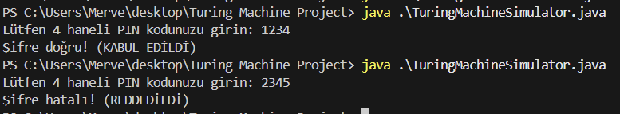

# TuringMachineSimulator – PIN Doğrulama Turing Makinesi (Java)

Bu proje, bir Turing makinesi modelini kullanarak ATM'deki PIN doğrulama sistemini simüle eder. Kullanıcıdan alınan PIN kodu, sistemde tanımlı sabit bir PIN koduyla Turing makinesi üzerinden karşılaştırılır.
# Youtube link
https://youtu.be/vAMxgFNDTL4
# images
<p align="center">


</p>
##  Amaç

- Turing makinesi kavramını gerçek bir senaryo ile uygulamak
- Teorik bilgisayar bilimini pratik yazılım geliştirme ile ilişkilendirmek
- Temiz kod (Clean Code) ilkeleriyle örnek geliştirme

---

##  Kuramsal Arka Plan

Turing makineleri, hesaplama kuramında temel bir model olup, her türlü algoritmanın formel olarak ifade edilmesini sağlar. Bu projede:

- PIN doğrulama süreci bir **karar problemi** olarak modellenmiştir.
- Bant yapısı: `#KULLANICI_PIN#SISTEM_PIN#`
- Alfabe: `{0-9, #, B}` (rakamlar, ayraç ve boşluk)

---

##  Girdi Biçimi

- Kullanıcı PIN: Konsoldan girilir, **4 haneli** olmalıdır (örneğin `1234`)
- Sistem PIN: Kod içerisinde sabit olarak `"1234"` tanımlıdır
- Bant Yapısı: `#1234#1234#` gibi

---

## Turing Makinesi Durumları

| Durum               | Açıklama                                                |
|--------------------|----------------------------------------------------------|
| `START`            | Başlangıç karakterini (`#`) kontrol eder                 |
| `READ_USER_PIN`    | Kullanıcı PIN rakamlarını sırayla okur                   |
| `MOVE_TO_SYSTEM_PIN` | Sistem PIN karşılaştırma konumuna geçer               |
| `COMPARE_DIGITS`   | Karakter eşleşmesini kontrol eder                        |
| `ACCEPT`           | PIN’ler eşleşirse kabul durumu                           |
| `REJECT`           | Herhangi bir fark varsa red durumu                       |

---

##  Nasıl Çalıştırılır?

### 1. Gereksinimler

- Java JDK 8 veya üzeri
- Terminal / Komut Satırı veya VS Code gibi bir IDE

### 2. Derleme ve Çalıştırma

```bash
javac TuringMachineSimulator.java
<<<<<<< HEAD
java TuringMachineSimulator 
=======
java TuringMachineSimulator
>>>>>>> 0701e66b86cb16ed894726f2a54bc5d510f0333f
